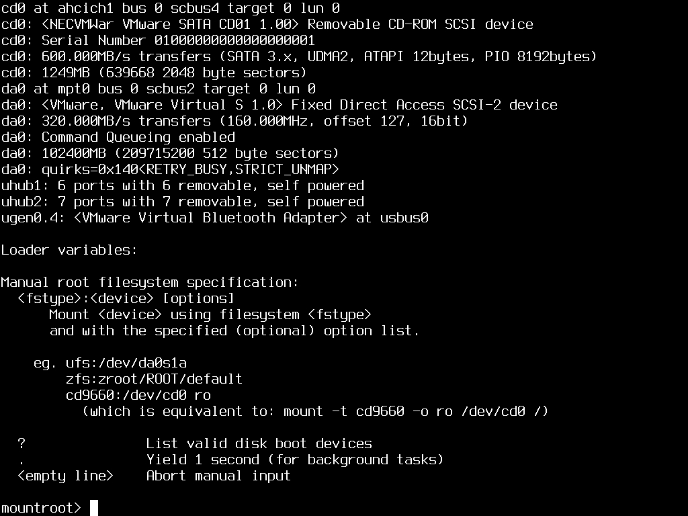
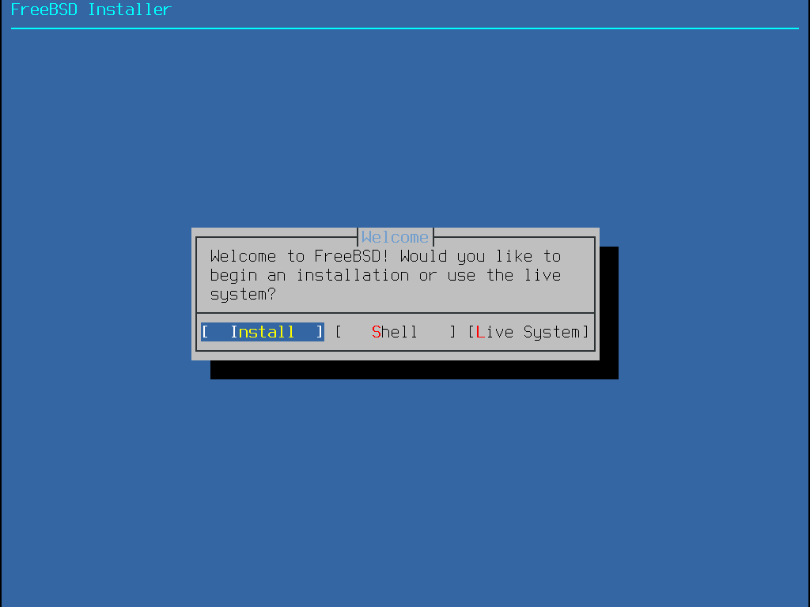

# beastie boot

## A project written in C++ that boots FreeBSD on Linux using Kexec

Beastie is a tool for booting FreeBSD. The main value of this program is adding support for FreeBSD within UEFI bootloader's. It was originally written to add FreeBSD support to [ZFS Boot Menu](https://docs.zfsbootmenu.org/en/v3.0.x/).

## How to build

```sh
cmake -B build -S .
cmake --build build -j30
```

If you want the disassembler listing (for debugging the boot ROM):
```sh
cmake -B build -S . -DBEASTIE_USE_LLVM=true
cmake --build build -j30
```

## Example usage

```
beastie /mnt/freebsd-root
```

## Debugging

Debugging variables can be inspected,

```
beastie --debug --pretend /mnt/freebsd-root
```

There is a lot to write about the art of debugging. A basic starting point is to run qemu with a debug server, `qemu-system-x86_64 -s -S`, connect to it using `gdb -iex "target remote :1234"` and then set a breakpoint:

```gdb
symbol-file /mnt/freebsd-root/boot/kernel/kernel
hbreak hammer_time
continue
```

## Screenshots

### Running Beastie


### FreeBSD Booting, with Font Support


### Waiting for Root Device


### Welcome!


## Known Problems

### Graphics Cards and Framebuffers are Complicated

QEMU in VGA mode seems to work well. VMWare Workstation[^1] also seems to work well in its native VMSVGAII mode. However *beastie* does not seem to work yet on real hardware. This is because of VGA issues. Work is ongoing and I hope to add more support for different systems.


- [x] QEMU VGA
- [x] VMware SVGA-II
- [ ] Alienware M18 R2 (Xe card)

[^1]: [VMware Fusion and Workstation are Now Free for All Users
](https://blogs.vmware.com/cloud-foundation/2024/11/11/vmware-fusion-and-workstation-are-now-free-for-all-users/)
